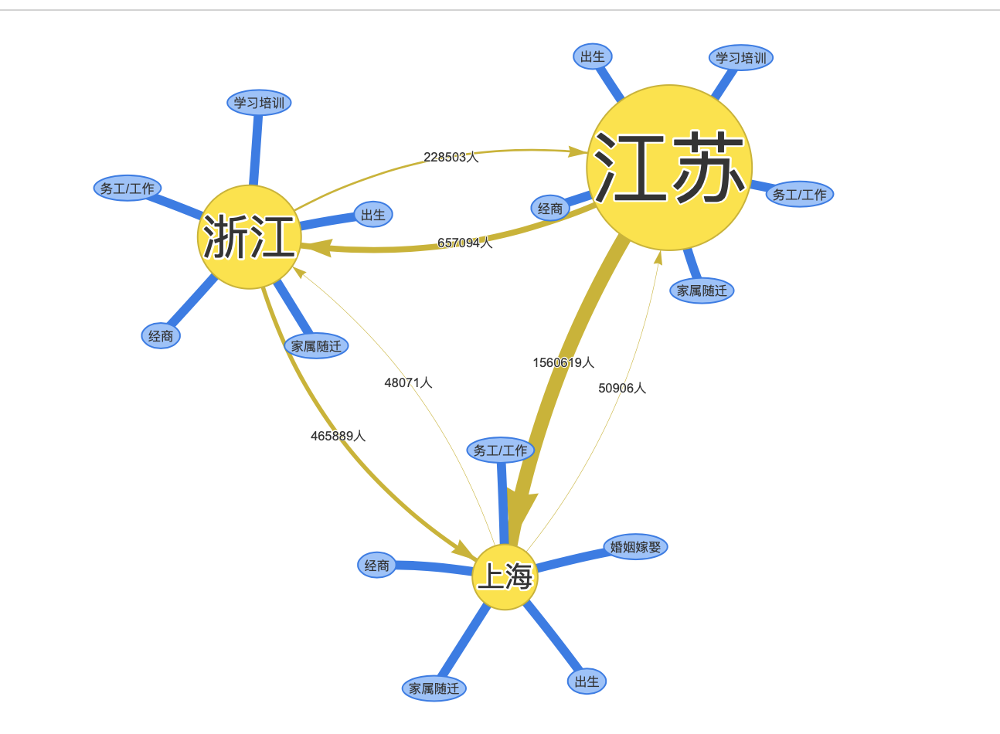

## Draw knowledge Graph 

* drawing migration and industry relation graph by html, because gephi cannot draw the curve line with arrows.

## Processing
*  drawing the nodes and edges by networkx which is popular python module for drawing networks

## Running the html 

* running the arrows.html by web browser 

## Ouput Example 

 